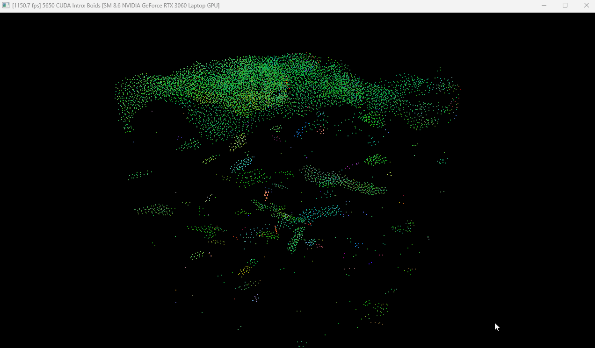
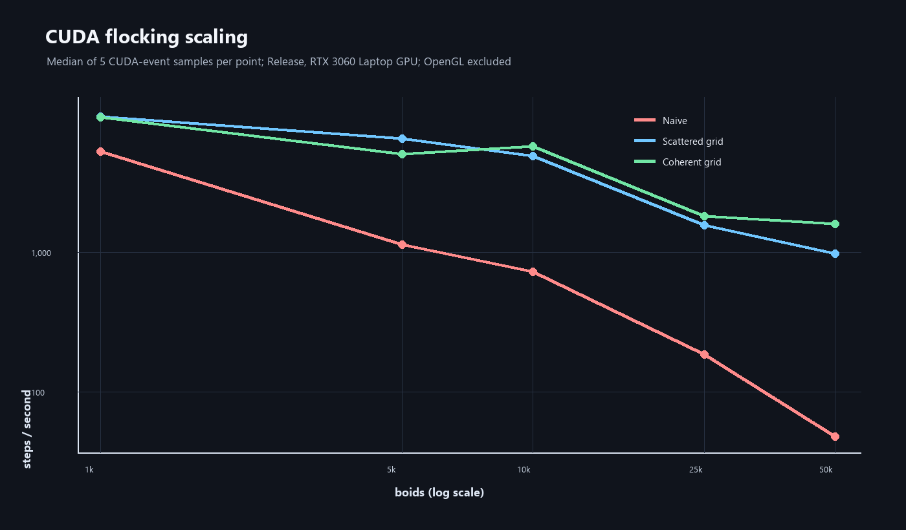
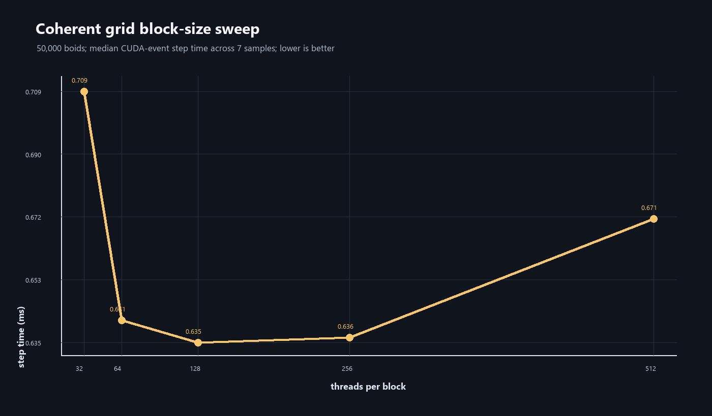
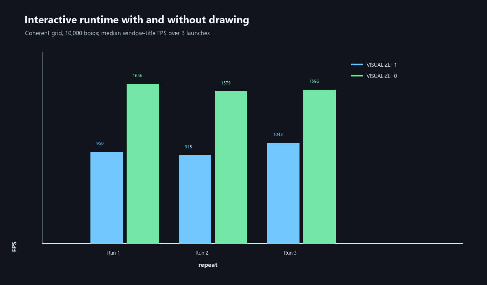

# CUDA Flocking Simulation

**Summerfruity** | [GitHub](https://github.com/Summerfruity) | University of Pennsylvania CIS 5650 Project 1



*A 3D flock of 10,000 CUDA-updated boids rendered through CUDA/OpenGL
interoperability on an NVIDIA GeForce RTX 3060 Laptop GPU.*

This project is a real-time 3D flocking simulation implemented with CUDA. Each
particle is a boid that changes its velocity according to the Reynolds flocking
rules (cohesion, separation, and alignment). CUDA updates the simulation on the
GPU, while CUDA/OpenGL interoperability streams the positions and velocities
directly into OpenGL vertex buffers for visualization.

The implementation contains three update paths that make the cost of neighbor
search explicit:

1. A brute-force all-pairs implementation.
2. A uniform-grid implementation with indirect (scattered) position/velocity
   reads.
3. A uniform-grid implementation that rearranges boid data into cell order for
   more coherent memory access.

The current source configuration enables the coherent uniform-grid path and
starts 10,000 boids (`src/main.cpp`). The particle count and update path are
compile-time settings, so smaller counts are recommended for interactive
performance or GPUs with limited memory.

## Highlights

- CUDA kernels for initialization, velocity updates, position integration, grid
  construction, data rearrangement, and OpenGL buffer copies.
- Reynolds boid rules with independent interaction radii and weights.
- Ping-pong velocity buffers so every boid reads the same previous-frame state.
- A 3D uniform grid built with a Thrust key/value sort.
- A coherent data layout that removes one level of indirection during neighbor
  traversal.
- OpenGL 3.3 point rendering with vertex, geometry, and fragment shaders.
- Live FPS and CUDA device information in the window title.
- A small startup Thrust sort test in `Boids::unitTest()` for checking the CUDA
  and Thrust setup.

## Visual output

The application opens a 1280 x 720 OpenGL window and renders each boid as a
point. Position is used for the point location; velocity is passed to the
fragment shader, offset by `0.3`, and mapped to RGB using its absolute
components. The camera looks at the origin and can be orbited or zoomed with
the mouse.

The repository also includes the following uniform-grid diagrams used to
explain the data structure and neighbor search:


*A spatial partition divides the simulation volume into cells.*


*A boid only needs to inspect cells that can contain neighbors within its rule
radii.*


*The scattered layout sorts cell IDs while retaining an indirection array back
to the original boid data.*


*The coherent layout rearranges positions and velocities so cell-local reads are
contiguous.*

These are algorithm diagrams rather than captures of a particular runtime
configuration. FPS and visual composition depend on the selected GPU, driver,
particle count, and compile-time mode.

## Flocking model

For a boid `i`, the velocity update starts with its current velocity and adds
the contributions from nearby boids:

```text
cohesion   = (average neighbor position - position[i]) * 0.01
separation = sum(position[i] - neighbor position) * 0.10
alignment  = average neighbor velocity * 0.10

velocity[i] = velocity[i] + cohesion + separation + alignment
```

The implementation uses these squared-distance thresholds:

| Rule | Meaning | Radius | Scale |
| --- | --- | ---: | ---: |
| Cohesion | Move toward the local center of mass | 5.0 | 0.01 |
| Separation | Push away from nearby boids | 3.0 | 0.10 |
| Alignment | Match the local average velocity | 5.0 | 0.10 |

After the rule contributions are applied, velocity is clamped to a maximum
speed of `1.0`. Positions are integrated with `DT = 0.2` and wrapped back to the
opposite side when they cross any boundary of the simulation box
`[-100, 100]^3`.

The initial positions are deterministic pseudo-random points in that box. The
initial velocities are smaller pseudo-random vectors in approximately
`[-0.1, 0.1]^3`. The two velocity buffers are swapped after each step so that a
kernel never observes partially updated neighbor velocities.

## CUDA update paths

### 1. Naive all-pairs search

`Boids::stepSimulationNaive()` launches one velocity kernel followed by one
position kernel. Each boid checks every other boid, giving `O(N^2)` neighbor
checks per frame. This path is useful as a correctness reference and becomes
expensive quickly as `N` grows.

### 2. Scattered uniform grid

`Boids::stepSimulationScatteredGrid()` uses a spatial hash represented by a
regular 3D grid:

1. `kernComputeIndices` assigns every boid a grid-cell ID and records its
   original array index.
2. `thrust::sort_by_key` groups equal cell IDs together.
3. `kernResetIntBuffer` clears the per-cell range arrays.
4. `kernIdentifyCellStartEnd` records the contiguous start/end range for every
   occupied cell.
5. `kernUpdateVelNeighborSearchScattered` checks only nearby cells and follows
   the sorted index array to read the original position and velocity arrays.

The largest rule radius is 5, so the cell width is `2 * 5 = 10`. With the
current scene scale this produces 22 cells per axis, or 10,648 cells total.
Because a neighbor can be in any adjacent cell, the kernel visits up to 27
cells (3 x 3 x 3) and still performs an exact distance test before applying a
rule. The current implementation uses this conservative 27-cell loop even
though a cell width of twice the largest radius permits a tighter search in
some cases.

### 3. Coherent uniform grid

`Boids::stepSimulationCoherentGrid()` keeps the same grid construction but adds
`kernRearrangeData`. Positions and velocities are copied into the order created
by the cell sort, so boids in the same cell are contiguous in memory. The
coherent neighbor kernel can then read `pos[j]` and `vel[j]` directly instead of
performing an extra `particleArrayIndices[j]` lookup. This improves locality at
the cost of an additional `O(N)` rearrangement and the same per-frame sort.

For an evenly distributed 50,000-boid benchmark scene, the average occupancy is
about 4.7 boids per cell. A 27-cell search can therefore inspect roughly 127
candidates before the exact radius tests; the actual number changes with the
evolving distribution. This is why sorting and memory locality matter even
after the quadratic all-pairs search has been removed.

## Compile-time configuration

The dispatch is controlled by the defines near the top of `src/main.cpp`:

```cpp
#define VISUALIZE 1
#define UNIFORM_GRID 1
#define COHERENT_GRID 1
```

| `UNIFORM_GRID` | `COHERENT_GRID` | Path |
| ---: | ---: | --- |
| 0 | ignored | Naive all-pairs |
| 1 | 0 | Scattered uniform grid |
| 1 | 1 | Coherent uniform grid |

The other commonly adjusted settings are:

- `N_FOR_VIS` in `src/main.cpp`: number of simulated and rendered boids.
- `DT` in `src/main.cpp`: simulation timestep.
- Rule radii, rule scales, `maxSpeed`, and `scene_scale` in `src/kernel.cu`.
- `FLOCKING_BLOCK_SIZE` in CMake: CUDA threads per block, currently 128.

`FLOCKING_VISUALIZE` is the CMake-facing form of the `VISUALIZE` switch. Set it
to `0` to skip the CUDA-to-OpenGL VBO copy, point draw, and buffer swap while
keeping the same simulation loop. The program still creates a GLFW/OpenGL
context, polls events, clears the frame, and maps/unmaps the OpenGL buffers, so
this is an end-to-end no-draw comparison rather than a kernel-only timing mode.
For a meaningful FPS comparison, build Release, keep the particle count fixed,
and disable driver VSync.

## Requirements

- NVIDIA GPU supported by the installed CUDA Toolkit. The original assignment
  targets compute capability 3.0 or newer; newer CUDA toolkits may impose a
  higher minimum, so check the toolkit compatibility matrix for the local
  machine.
- CUDA Toolkit with `nvcc`, the CUDA runtime, CUDA/OpenGL interop, and the
  CCCL/Thrust headers and CMake package.
- CMake 3.18 or newer.
- A C++17 host compiler with CUDA C++17 language support. Visual Studio 2022 is
  used by the existing Windows build; GCC or Clang can be used on Linux.
- OpenGL 3.3, GLFW, GLEW, and GLM. Windows builds can use the libraries under
  `external/`; Linux builds use the packages found by CMake.
- A desktop/display session because GLFW creates an interactive OpenGL window.
- Python 3 and Pillow are needed only to regenerate the PNG performance charts
  with `python benchmarks/plot_results.py` (`python -m pip install pillow`).

## Build

Run the commands from the repository root. A clean build directory is useful
when changing generators or toolchains.

### Windows (Visual Studio 2022)

```powershell
cmake -S . -B build -G "Visual Studio 17 2022" -A x64
cmake --build build --config Release
```

Launch the executable while the working directory is the repository root (or
the `build` directory, where CMake copies the shaders):

```powershell
.\build\bin\Release\cis5650_boids.exe
```

The generated target is `cis5650_boids`. Debug, MinSizeRel, and RelWithDebInfo
configurations are also supported by CMake.

This checkout extends the original `CMakeLists.txt` with two cache options,
`FLOCKING_BLOCK_SIZE` and `FLOCKING_VISUALIZE`, plus the
`cis5650_benchmark` target used for the CUDA-event measurements below. These
changes are intentionally kept in CMake so Visual Studio and command-line
builds use the same configuration.

### Linux

Install the development packages for CUDA, OpenGL, GLFW, GLEW, GLM, and CCCL,
then configure and build a Release target:

```bash
cmake -S . -B build -DCMAKE_BUILD_TYPE=Release
cmake --build build --parallel
./build/bin/cis5650_boids
```

The included `GNUmakefile` is a convenience wrapper around the same CMake
workflow:

```bash
make Release
```

The `CMakeLists.txt` file enables C++17 and CUDA17, selects a native CUDA
architecture on recent CMake versions, links OpenGL/GLFW/GLEW/Thrust, and copies
the `shaders/` directory into the build tree before compiling the executable.

## Controls

| Input | Action |
| --- | --- |
| Left mouse drag | Orbit the camera around the origin |
| Right mouse drag vertically | Zoom in or out |
| `Esc` | Close the window |

There are no runtime sliders or mode switches. Change the compile-time settings
described above and rebuild to compare the three simulation paths.

## Performance Results

The repository includes a headless benchmark target so CUDA timings do not
depend on window compositing or monitor refresh. `cis5650_benchmark` initializes
the same simulation state, warms up the selected path, then uses CUDA events
around repeated simulation steps. The checked-in scaling CSV contains five timed
samples per point, with twenty steps per sample and ten warm-up steps; these
measurements exclude OpenGL rendering. The executable defaults are more
conservative (`10` samples and `20` warm-up steps), so pass the flags shown
below when reproducing the checked-in table.

Test system:

| Component | Configuration |
| --- | --- |
| OS | Windows 11 Home 64-bit |
| CPU | AMD Ryzen 7 6800H, 8 cores / 16 threads |
| GPU | NVIDIA GeForce RTX 3060 Laptop GPU, 6 GB, compute capability 8.6 |
| Driver / CUDA | Driver 616.92 / CUDA 13.1 |
| Compiler / build | Visual Studio 2022, CMake 4.2, Release |

The measured scaling data is in
[`benchmarks/results_agent_cuda.csv`](benchmarks/results_agent_cuda.csv). The
headline results below report median CUDA-event time:

| Boids | Naive | Scattered grid | Coherent grid |
| ---: | ---: | ---: | ---: |
| 10,000 | 724 steps/s (1.381 ms) | 4,855 steps/s (0.206 ms) | 5,688 steps/s (0.176 ms) |
| 50,000 | 48 steps/s (20.834 ms) | 974 steps/s (1.027 ms) | 1,590 steps/s (0.629 ms) |

At 50,000 boids, the coherent grid is about 33x faster than the all-pairs
baseline and about 1.6x faster than the scattered grid in this headless test.
The grid methods avoid the quadratic neighbor scan; the coherent variant adds a
rearrangement pass but removes an indirect position/velocity lookup during the
neighbor traversal.



*Median steps per second versus boid count. CUDA-event measurements, Release
build, RTX 3060 Laptop GPU; OpenGL excluded.*

The block-size sweep used 50,000 coherent-grid boids and seven samples per
point. The best median in this run was 128 threads per block at 0.635 ms per
step. The 64- and 256-thread configurations measured 0.641 ms and 0.636 ms,
while 32 and 512 threads measured 0.709 ms and 0.671 ms. These values are
hardware-specific rather than universal defaults; 128 remains the default
because it is the best point in this sweep.



*Median step time versus CUDA threads per block. Lower is better; raw data is in
[`benchmarks/blocksize_results_clean.csv`](benchmarks/blocksize_results_clean.csv).*

The interactive executable was sampled from its window title with the coherent
path and 10,000 boids. Three independent runs were recorded for each setting:

| Setting | Run 1 | Run 2 | Run 3 | All-sample median |
| --- | ---: | ---: | ---: | ---: |
| `FLOCKING_VISUALIZE=1` | 950 FPS | 915 FPS | 1,043 FPS | 953 FPS |
| `FLOCKING_VISUALIZE=0` | 1,656 FPS | 1,579 FPS | 1,597 FPS | 1,603 FPS |

The no-draw build is about 1.7x faster in this run, showing the cost of the
CUDA/OpenGL copy and point rendering. It still includes buffer map/unmap and
the GLFW main loop; use the CUDA-event benchmark above for kernel-focused
comparisons. Raw samples are in
[`benchmarks/runtime_fps.csv`](benchmarks/runtime_fps.csv) and
[`benchmarks/runtime_fps_novis.csv`](benchmarks/runtime_fps_novis.csv).



*Window-title FPS across three launches, with and without drawing. The run was
not visibly capped at 60 FPS; reproduce with V-Sync disabled for comparable
results.*

To reproduce the headless test:

```powershell
cmake -S . -B build -G "Visual Studio 17 2022" -A x64 -DFLOCKING_BLOCK_SIZE=128
cmake --build build --config Release --target cis5650_benchmark --parallel 2
.\benchmarks\run_benchmark.ps1 -Objects @(1000,5000,10000,25000,50000) `
    -Warmup 10 -Samples 5 -Steps 20 -Output benchmarks/results_agent_cuda.csv
```

To reproduce the block-size chart:

```powershell
.\benchmarks\run_blocksize.ps1
python benchmarks/plot_results.py
```

To build the no-draw runtime variant, configure a separate build directory so
the normal visual build remains unchanged:

```powershell
cmake -S . -B build_novis -G "Visual Studio 17 2022" -A x64 -DFLOCKING_VISUALIZE=0
cmake --build build_novis --config Release --target cis5650_boids --parallel 2
.\build_novis\bin\Release\cis5650_boids.exe
```

The interactive FPS path remains useful for end-to-end behavior, but the
headless CUDA-event target is the more stable basis for comparing algorithms.

## Source tree

```text
src/
  main.cpp              GLFW/OpenGL setup, main loop, CUDA-GL interop, controls
  main.hpp              OpenGL objects, camera state, shared declarations
  kernel.cu             CUDA state, kernels, grid construction, simulation steps
  kernel.h              Public Boids simulation interface
  glslUtility.*         GLSL loading, compilation, and program linking
  utilityCore.*         Small GLM/CUDA math and utility helpers
  cudaMat4.hpp          CUDA-compatible matrix structures
shaders/
  boid.vert.glsl        Passes position and velocity to the pipeline
  boid.geom.glsl        Applies the camera projection to each point
  boid.frag.glsl        Converts velocity to the point color
external/                Windows GLFW, GLEW, and GLM headers/libraries
images/                  Uniform-grid diagrams, setup image, and PNG charts
boids.gif                Captured interactive demo
CMakeLists.txt           Cross-platform CMake target definition
GNUmakefile              Unix build convenience wrapper
INSTRUCTION.md            Original CIS 5650 project specification
benchmarks/
  benchmark_main.cpp      Headless CUDA-event benchmark executable
  run_benchmark.ps1       Boid-count/mode sweep
  run_blocksize.ps1       Threads-per-block sweep
  plot_results.py         PNG chart generator
  *.csv                   Checked-in raw timing samples
```

## Correctness and performance notes

- The naive path is the clearest reference implementation, but its neighbor
  loop is quadratic in the number of boids.
- Both grid paths still pay for a per-frame key sort and a scan of the cell
  ranges. The coherent path additionally copies position and velocity data into
  sorted buffers.
- The simulation wraps positions at the domain boundary, but neighbor distance
  tests use ordinary Euclidean offsets. Boids on opposite faces therefore do
  not interact through the wrap boundary.
- `cudaGLSetGLDevice(0)` and the legacy `cudaGL*` interop API assume that CUDA
  and OpenGL use the same GPU. Multi-GPU systems may need local device/driver
  configuration.
- There is no automated unit-test suite. `Boids::unitTest()` performs a small
  Thrust key/value sort during startup and prints the result; it is a setup
  smoke test rather than a full simulation validation.
- CUDA errors are reported through the project's `checkCUDAError` helper. For
  profiling or debugging, add explicit synchronization/timing around the
  kernels and compare all three compile-time paths on the same hardware.

## Author and tested configuration

- Author: `summerfruity`
- Tested configuration: Windows build generated by Visual Studio 17 2022,
  NVIDIA GeForce RTX 3060 Laptop GPU (6 GB), CUDA Toolkit 13.1, and CMake 4.2.

The reported GPU and FPS are machine-dependent. The repository records the
implementation and build configuration, not a universal performance result.
